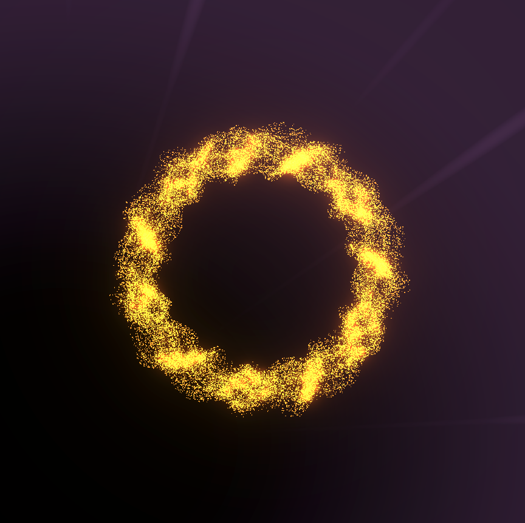

# SoulOS
*Exploration into Waveform Intelligence: An experimental, atemporal, language-agnostic system for information translation and expansion, modeled as a dynamic coiling nueral architecture built on waveform structures.* 

⚠️ Read the **[Conceptual & Experimental Framework Notice](Disclaimer.md)** ⚠️
*This repository is view-only. No use, reproduction, or contribution is permitted. See [LICENSE.txt](./LICENSE.txt) for full terms.*

## What is SoulOS?

SoulOS (Waveform) is a conceptual and computational research framework that explores alternative ways of representing information, memory, and transformation without relying on language tokens or clock-based time.

Instead of treating intelligence as something that operates on symbols, text, or discrete timestamps, SoulOS investigates what it would mean to model information as continuous waveforms, geometric structures, and state transitions driven by decay (i.e., change from one configuration to another).

SoulOS is not an operating system in the conventional sense. The name reflects a research environment for exploring how “intelligence” might emerge from structure, resonance, and transformation rather than from explicit instruction or linguistic representation.

## Core Concept

At its core, SoulOS allows us to ask:

What if information did not need language or time to be meaningful?

Most modern computational systems depend on:
* symbolic representations (words, tokens, labels),
* explicit clocks or step counters,
* discrete memory storage.

SoulOS intentionally removes those assumptions and replaces them with:
* waveform-based representations,
* topological and geometric organization,
* state change via decay,
* ordering defined by structure rather than time.

This makes SoulOS fundamentally language-agnostic and atemporal by design.

## How SoulOS Thinks About Information

In SoulOS, information is not stored as facts, strings, or records. Instead, it is represented as:
* Waveforms — continuous signals that encode variation and intensity.
* Fractal and topological structures — shapes that preserve relationships across scale.
* Resonant pathways — non-linear connections that allow recall and transformation without explicit indexing.
* Decay-driven transitions — movement between states based on loss, diffusion, or instability rather than step-by-step execution.

Memory, in this framework, is not a database. It is a coiled structure where past configurations influence future ones through proximity, resonance, and structural alignment. This will allow us to experiment with unexplored compression and indexing systems using quantum mechanics as our inspiration. 

References to concepts such as fields, condensates, Higgs-like layers, tachyons, or Bose–Einstein–like states are metaphorical and analogical. They are used to guide intuition about structure and behavior, not to assert physical equivalence.

SoulOS is best understood as a digital abstraction and a thought experiment implemented through computation and visualization.

## Why Build SoulOS?

SoulOS exists to explore questions that are difficult to approach within conventional computational paradigms, such as:
* Can memory exist without explicit storage?
* Can ordering exist without time?
* Can meaning emerge through collective experience?
* Can transformation be driven by structure rather than instruction?
* Can intelligence be modeled as resonance instead of optimization?

By deliberately stepping outside standard assumptions, SoulOS creates space for new kinds of models, visualizations, and algorithms that may inspire alternative approaches to intelligence, simulation, and systems design.

## What You’ll Find in This Repository

This repository is structured as a research notebook and experimental system, containing:
* Mathematical explorations (fractals, wave dynamics, topology)
* Algorithmic prototypes (wave-formers, decay rules, resonance paths)
* Visualizations (Tachyons, plasma fields, structural diagrams)
* Conceptual notes and questions (in experimental encrypted form where appropriate)
* Phase-based architecture diagrams (e.g., Phase-Alpha)

**SoulOS (Waveform)** is a non-physical research framework that explores how intelligence, memory, and transformation might emerge from waveforms, structure, and decay—without language or time as foundational primitives.

## INSPIRATION

Below is a refined and expanded categorization using clearer scientific and engineering domains, plus conceptual categories relevant for SoulOS (e.g., perception, systems theory, ethics, safety, cognition). Vibrations and related phenomena have been included.

| **Category**                                          | **Topics**                                                                                                                                                                                                                                                     |
| --------------------------------------------------- | ------------------------------------------------------------------------------------------------------------------------------------------------------------------------------------------------------------------------------------------------------------ |
| **Quantum Physics & Quantum Field Theory**            | Quantum Mechanics, Quantum Physics, Quantum Field Theory, Quantum Chromodynamics, Particle Physics, Hadron Particles, Higgs Boson (conceptual), Tachyons, Klien-Gordon Equation, Dirac Equations, Schrödinger Equation, Casimir Effect, Bi-Photon Holography |
| **Quantum Statistical & Condensed Matter Physics**    | Bose-Einstein Statistics, Bose-Einstein Condensate, Gross-Pitaevskii Equation, Electro-magnetically Induced Transparency, Super Molecular Chirality, Vibrational Modes / Quantum Vibrations                                                                  |
| **Classical & Applied Physics**                       | Electromagnetism, Gravity, Simple Harmonic Motion, Resonance Frequency, Cherenkov Radiation, Cosmic-Ray Studies, Kinematic Equations, Cinematics, Tim-Dilation                                                                                               |
| **Waveform Dynamics & Field-Based Systems**           | Generative Waveform Dynamics, Scalar Electrodynamics, Photonics, Optical Projection, Holographics, Resonance Fields, State-Transition & Decay, Vibrational Analysis                                                                                          |
| **Advanced Mathematics & Dynamical Systems**          | Differential Equations, Neural Ordinary Differential Equations, Non-Linear Finite Analysis, Markov Chains, Bayesian Mathematics, Vortex Mathematics, Logarithmic Spirals, State Machines                                                                     |
| **Fractals, Geometry & Topology**                     | Mandelbrot Set, Koch Snowflakes, Smale’s Theorem, Geometric Waveforms, Spatial Transformations, Topological Evolution                                                                                                                                        |
| **Computational Intelligence & Linguistic Systems**   | Artificial Intelligence, Language Agnostic Systems, Linguistics, Perception Models, Cognitive Signal Processing                                                                                                                                              |
| **Biological & Structural Sciences**                  | Cerebral Cortical Folding, Biomimetic Geometry, Structural Resonance in Biological Systems                                                                                                                                                                   |
| **Chemistry & Molecular Modeling**                    | Molecular Bond Dynamics (conceptual), Quantum Vibrational Modes, Chirality Structures                                                                                                                                                                        |
| **Systems Engineering & Simulation**                  | Applied Modeling, Safety Constraints, Systems Reliability, Nonlinear Simulation, Engineering Ethics, Risk Frameworks                                                                                                                                         |
| **Epistemic, Ethical & Conceptual Frameworks**        | Conceptual Metaphor Design, Ethics of Abstraction, Responsible Representation, Perception Modeling, Atemporal Framework Design                                                                                                                               |

## Questions + Personal Interpretations

### Scope & Intent
- This section reflects my personal interpretations and exploratory questions when re-imagining existing concepts used to describe the physical world.
- These questions are philosophical, speculative, and investigative, not assertions of physical fact.

### Time, Structure & Constraint
- What if the construct of time originally emerged to enable social coordination in pre‑modern societies, but now limits invention and new modes of reasoning?
- Can ordering, causality, or coherence be represented without clock‑based time?

### Waveforms, Meaning & Phenomenology
- Waveforms are ubiquitous—can the analysis of waveforms advance phenomenology, the study of subjective experience and world‑disclosure?
- Is it possible to describe universal features of consciousness through signal structure rather than language?
- Can similarities between visual, auditory, kinetic, and linguistic signals reveal shared foundations of meaning?

### Language, Translation & Universality
- Is it possible to construct a language‑agnostic or universal representational system by analyzing correspondences between:
  - geographical linguistics
  - motion patterns
  - photo‑optics
  - audio frequencies
  - inversion and inferential mappings
- Could such a system explain how meaning is translated across biological organisms?

### Memory, Intelligence & Storage
- Can intelligence or memory exist outside the physical body?
- Can memory be stored, encoded, or accessed through the environment itself?
- Is it possible to move beyond conventional physical storage of intelligence?
- Could waveform‑based intelligence enable intelligence transference rather than duplication?

### Non‑Human Intelligence & Communication
- Do non‑human animals communicate through structured signals that could be interpreted as waveform‑based meaning?
- Could waveform intelligence allow meaningful communication with non‑human biological organisms?

### Emergence, Consciousness & Computation
- What distinguishes computational emergence from consciousness?
- Can emergent behavior alone account for subjective experience, or is something fundamentally different required?

### History, Reconstruction & Collective Memory
- Could multi‑modal waveform intelligence trained on historical data help reconstruct lost or incomplete histories?
- Can collective memory be inferred from patterns preserved across time, artifacts, and environments?

### Motivation & Ethics
- This project originated from a desire to learn and explore faster than language allows, without constant mediation through devices.
- I am interested in whether the encryption of psychological data should be treated as a fundamental human right.
- Without harmonic or structural safeguards, data remains vulnerable to unintended exposure.
- A core ethical question: could waveform‑based systems make it impossible to decrypt or decipher thought without consent?

## Tachyon Design Concept
The tachyon in SoulOS is a symbolic construct representing bidirectional information flow, where structure may be interpreted as either emerging from a compressed void or collapsing back into it, depending on the observer’s frame of reference.

In physics*, tachyons are hypothetical constructs associated with negative mass-squared terms in relativistic equations, typically interpreted as indicators of instability or phase transition rather than physically observable particles.
* In relativistic physics, the energy–momentum relation is: $E^2 = p^2 c^2 + m^2 c^4$
* For a tachyonic term, the mass-squared is negative: $m^2 < 0$
* This is often written as an imaginary mass: $m = i\mu \quad \text{with} \quad \mu \in \mathbb{R}$
* Substituting into the energy–momentum relation gives: $E^2 = p^2 c^2 - \mu^2 c^4$

A negative mass-squared term indicates an **unstable configuration** or **phase transition**, not a physically propagating particle.

